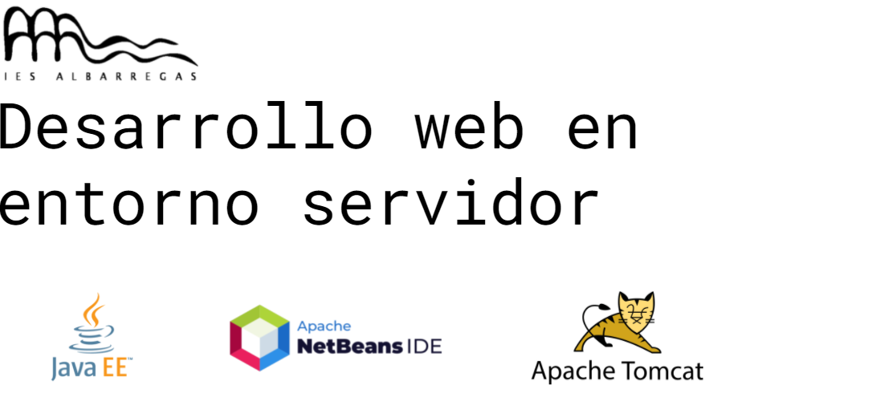
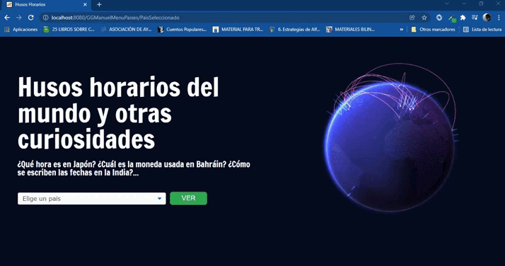
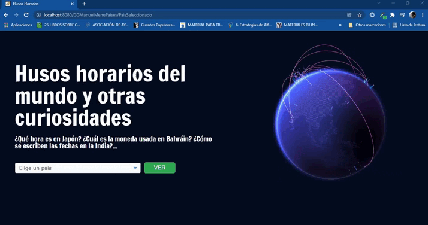
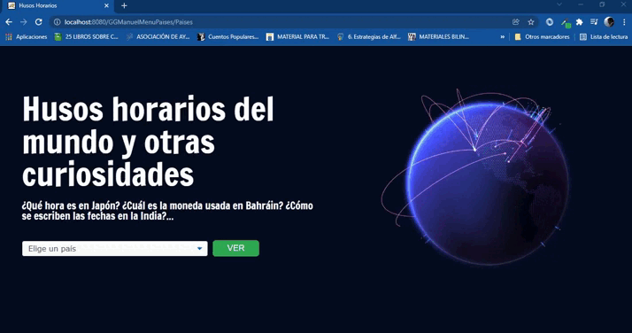

<hr style="height: 5px; background: #24292F;">


# GGManuelMenuPaises

# Contenidos

1. [Introducción](#introduccion)
2. [Herramientas](#herramientas)
6. [Requisitos](#requisitos)
6. [Recursos](#recursos)

<hr style="height: 5px; background: #24292F;"><a name="introduccion"></a>

# 1. Introducción

Desarrollamos una aplicación que nos permite seleccionar un país entre una lista y mostrar una serie de contenidos en el lenguaje del país elegido:

- Expresiones traducidas.
- Uso de fechas, horarios y números (decimales, tantos por ciento, monea).

<hr style="height: 5px; background: #24292F;"><a name="herramientas"></a>

# 2. Herramientas

         


<hr style="height: 5px; background: #24292F;"><a name="requisitos"></a>

# 3. Requisitos

Entre los requisitos que debían cumplirse según el enunciado, presentamos el trabajo de los que consideramos más importantes:

## A. Si pulsamos en el botón "ver" y no hemos seleccionado ningún país, volvemos a la misma página.



## B. Si elegimos un país del que no poseemos datos y pulsamos "ver" se nos redirige a la siguiente vista, pero esta mostrará los datos por defecto.



 

## C. Si elegimos un país del cual poseemos datos, redirigimos a la siguiente vista mostrando los contenidos requeridos en el enunciado.




<hr style="height: 5px; background: #24292F;"><a name="recursos"></a>

# 4. Recursos

- Librerías JSTL: 

```java
<%@taglib uri="http://java.sun.com/jsp/jstl/fmt" prefix="fmt"%>
<%@taglib uri="http://java.sun.com/jsp/jstl/core" prefix="c"%>
<%@taglib uri="http://java.sun.com/jsp/jstl/functions" prefix="fn"%>
```

- Estilo inspirado en la página de inicio de [github](https://github.com/).
